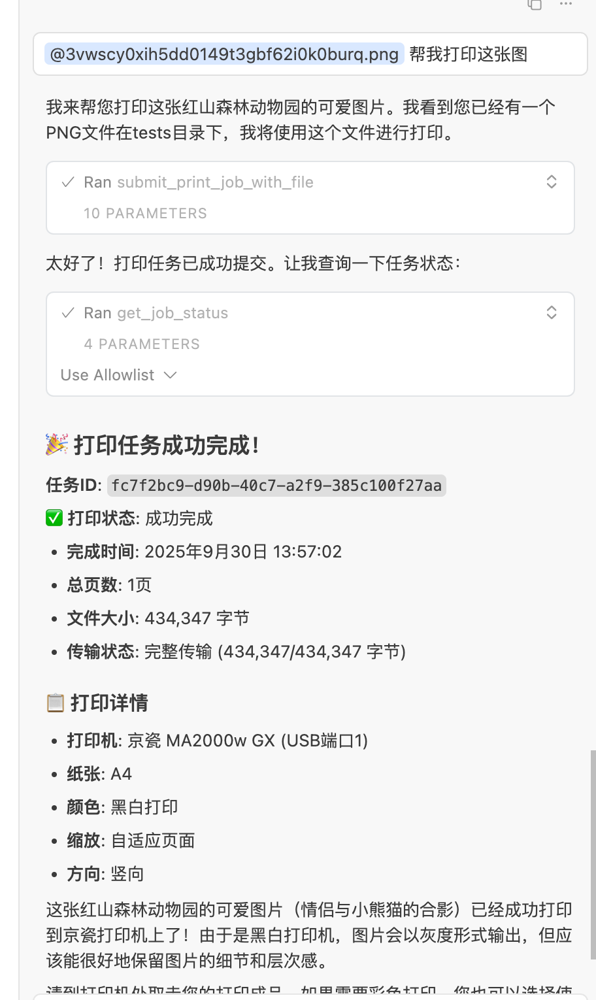

# 链科云打印盒 MCP 服务器

这是一个基于 MCP (Model Context Protocol) 的链科云打印盒服务器，提供云打印盒操作打印机的接口。

## 功能特性

### 🖨️ 打印机管理
- **获取打印机列表** - 查看设备连接的所有打印机
- **获取打印机参数** - 获取打印机支持的纸张尺寸、颜色等配置
- **获取纸张尺寸** - 查询打印机支持的纸张规格
- **打印机状态查询** - 实时获取打印机状态（缺纸、卡纸等）

### 📄 打印任务管理
- **提交打印任务** - 支持URL文件打印（图片、PDF、Office文档等）
- **本地文件打印** - 支持从MCP读取本地文件并上传打印
- **查询任务状态** - 实时查询打印任务进度
- **取消打印任务** - 取消排队中的打印任务

## 安装配置

### 1. 环境要求
- Python 3.8+
- uv 包管理器

### 2. 安装依赖
```bash
uv sync
```

> 💡 **获取API密钥**: 请到 [链科开放平台](https://open.liankenet.com/) 注册获取

### 4. 获取设备信息
从链科云盒设备二维码中获取：
- `deviceId` - 设备ID
- `deviceKey` - 设备密钥

## 使用方法

在cursor中部署

```json
{
  "mcpServers": {
    "printBoxHttpMcp": {
      "url": "http://127.0.0.1:8000/mcp",
      "headers": {
        "ApiKey": "",
        "deviceId": "",
        "deviceKey": ""
      }
    }
  }
}
```



### 启动MCP服务器
```bash
uv run main.py
```

### 扩展开发
可以基于现有接口扩展更多功能：
- 批量打印任务
- 打印模板管理
- 打印统计分析
- 设备监控告警

## 支持与反馈

如有问题或建议，请提交Issue或联系开发团队。

---

**链科云打印 MCP 服务器** - 让打印更简单！ 🚀